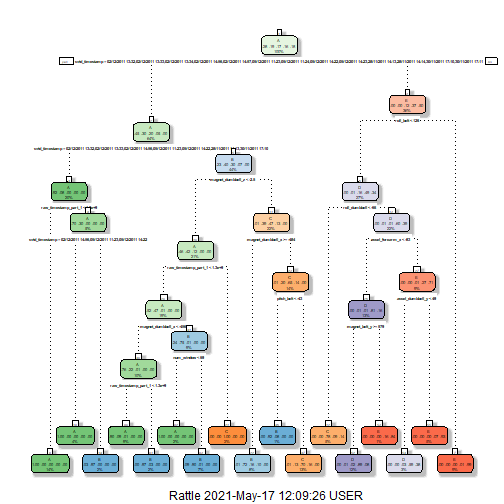
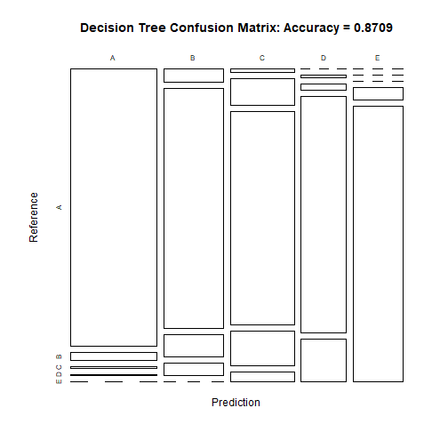
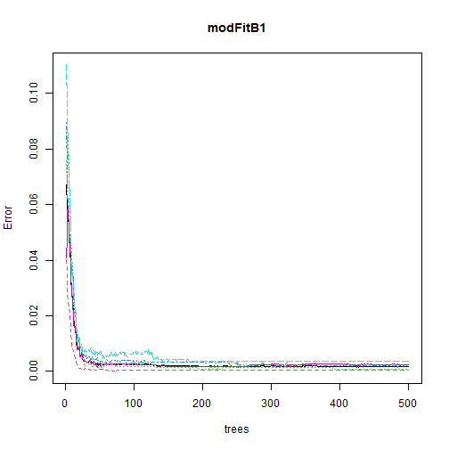
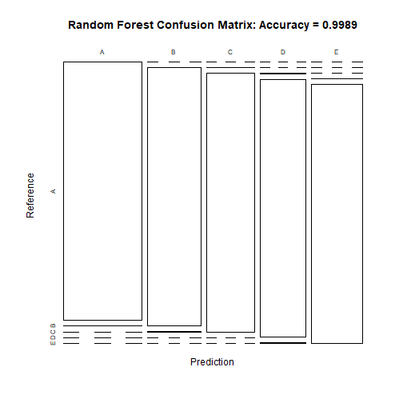

```r
library(caret)
library(rpart)
library(rpart.plot)
library(RColorBrewer)
library(rattle)
library(randomForest)
library(knitr)
```

## Project Introduction ##

####Summary####

In this project,practical machine learning models are used to predict the manner in which 6 participants conducted their exercise routines.The data is collected with the help of accelerometer attached to the belt,forearm,arm and dumbell of the participants.
#### Data ####

The training data for the project was downloaded from: 
https://d396qusza40orc.cloudfront.net/predmachlearn/pml-training.csv

The test data for the project was downloaded from: 
https://d396qusza40orc.cloudfront.net/predmachlearn/pml-testing.csv

The data for this project come from this source: http://groupware.les.inf.puc-rio.br/har.
#### Goal ####
The goal of your project is to predict the manner in which they did the exercise.Also the prediction modelis used to predict 20 different test cases. 

## Getting and loading the data ##


```r
set.seed(12345)
trainingUrl <- "http://d396qusza40orc.cloudfront.net/predmachlearn/pml-training.csv"
testingUrl <- "http://d396qusza40orc.cloudfront.net/predmachlearn/pml-testing.csv"
training <- read.csv(url(trainingUrl), na.strings=c("NA","#DIV/0!",""))
testing <- read.csv(url(testingUrl), na.strings=c("NA","#DIV/0!",""))
```

Splitting the training set into two sets:

```r
inTrain <- createDataPartition(training$classe, p=0.6, list=FALSE)
myTraining <- training[inTrain, ]
myTesting <- training[-inTrain, ]
dim(myTraining); dim(myTesting)
```

```
## [1] 11776   160
```

```
## [1] 7846  160
```

## Cleaning the data ##

Remove variables that have almost zero variance

```r
nzv <- nearZeroVar(myTraining, saveMetrics=TRUE)
myTraining <- myTraining[,nzv$nzv==FALSE]
nzv<- nearZeroVar(myTesting,saveMetrics=TRUE)
myTesting <- myTesting[,nzv$nzv==FALSE]
```

Remove the first column of the myTraining data set

```r
myTraining <- myTraining[c(-1)]
```

Clean variables with more than 60% NA

```r
trainingV3 <- myTraining
for(i in 1:length(myTraining)) {
    if( sum( is.na( myTraining[, i] ) ) /nrow(myTraining) >= .7) {
        for(j in 1:length(trainingV3)) {
            if( length( grep(names(myTraining[i]), names(trainingV3)[j]) ) == 1)  {
                trainingV3 <- trainingV3[ , -j]
            }   
        } 
    }
}
# Set back to the original variable name
myTraining <- trainingV3
rm(trainingV3)
```

Transform the myTesting and testing data sets

```r
clean1 <- colnames(myTraining)
clean2 <- colnames(myTraining[, -58])  # remove the classe column
myTesting <- myTesting[clean1]         # allow only variables in myTesting that are also in myTraining
testing <- testing[clean2]             # allow only variables in testing that are also in myTraining
dim(myTesting)
```

```
## [1] 7846   58
```

```r
dim(testing)
```

```
## [1] 20 57
```

Coerce the data into the same type

```r
for (i in 1:length(testing) ) {
    for(j in 1:length(myTraining)) {
        if( length( grep(names(myTraining[i]), names(testing)[j]) ) == 1)  {
            class(testing[j]) <- class(myTraining[i])
        }      
    }      
}
# To get the same class between testing and myTraining
testing <- rbind(myTraining[2, -58] , testing)
testing <- testing[-1,]
```

## Prediction with Decision Trees ##

```r
set.seed(12345)
modFitA1 <- rpart(classe ~ ., data=myTraining, method="class")
fancyRpartPlot(modFitA1)
```



```r
classe<-as.factor(myTesting$classe)
predictionsA1 <- predict(modFitA1, myTesting, type = "class")
cmtree <- confusionMatrix(predictionsA1, classe)
cmtree
```

```
## Confusion Matrix and Statistics
## 
##           Reference
## Prediction    A    B    C    D    E
##          A 2142   63    9    5    0
##          B   70 1294  121   64    0
##          C   20  152 1213  196   54
##          D    0    9   25  967  171
##          E    0    0    0   54 1217
## 
## Overall Statistics
##                                           
##                Accuracy : 0.8709          
##                  95% CI : (0.8633, 0.8782)
##     No Information Rate : 0.2845          
##     P-Value [Acc > NIR] : < 2.2e-16       
##                                           
##                   Kappa : 0.8367          
##                                           
##  Mcnemar's Test P-Value : NA              
## 
## Statistics by Class:
## 
##                      Class: A Class: B Class: C Class: D Class: E
## Sensitivity            0.9597   0.8524   0.8867   0.7519   0.8440
## Specificity            0.9863   0.9597   0.9349   0.9688   0.9916
## Pos Pred Value         0.9653   0.8354   0.7419   0.8251   0.9575
## Neg Pred Value         0.9840   0.9644   0.9750   0.9522   0.9658
## Prevalence             0.2845   0.1935   0.1744   0.1639   0.1838
## Detection Rate         0.2730   0.1649   0.1546   0.1232   0.1551
## Detection Prevalence   0.2828   0.1974   0.2084   0.1494   0.1620
## Balanced Accuracy      0.9730   0.9061   0.9108   0.8603   0.9178
```

```r
plot(cmtree$table, col = cmtree$byClass, main = paste("Decision Tree Confusion Matrix: Accuracy =", round(cmtree$overall['Accuracy'], 4)))
```



## Prediction with Random Forests ##

```r
set.seed(12345)
myTraining$classe<-factor(myTraining$classe)
modFitB1 <- randomForest(classe ~ ., data=myTraining)
predictionB1 <- predict(modFitB1, myTesting, type = "class")
cmrf <- confusionMatrix(predictionB1, classe)
cmrf
```

```
## Confusion Matrix and Statistics
## 
##           Reference
## Prediction    A    B    C    D    E
##          A 2232    1    0    0    0
##          B    0 1516    2    0    0
##          C    0    1 1364    0    0
##          D    0    0    2 1285    2
##          E    0    0    0    1 1440
## 
## Overall Statistics
##                                           
##                Accuracy : 0.9989          
##                  95% CI : (0.9978, 0.9995)
##     No Information Rate : 0.2845          
##     P-Value [Acc > NIR] : < 2.2e-16       
##                                           
##                   Kappa : 0.9985          
##                                           
##  Mcnemar's Test P-Value : NA              
## 
## Statistics by Class:
## 
##                      Class: A Class: B Class: C Class: D Class: E
## Sensitivity            1.0000   0.9987   0.9971   0.9992   0.9986
## Specificity            0.9998   0.9997   0.9998   0.9994   0.9998
## Pos Pred Value         0.9996   0.9987   0.9993   0.9969   0.9993
## Neg Pred Value         1.0000   0.9997   0.9994   0.9998   0.9997
## Prevalence             0.2845   0.1935   0.1744   0.1639   0.1838
## Detection Rate         0.2845   0.1932   0.1738   0.1638   0.1835
## Detection Prevalence   0.2846   0.1935   0.1740   0.1643   0.1837
## Balanced Accuracy      0.9999   0.9992   0.9985   0.9993   0.9992
```

```r
plot(modFitB1)
```



```r
plot(cmrf$table, col = cmtree$byClass, main = paste("Random Forest Confusion Matrix: Accuracy =", round(cmrf$overall['Accuracy'], 4)))
```




## Predicting Results on the Test Data ##

Random Forests gave an Accuracy in the myTesting dataset of 99.89%, which was more accurate that what I got from the Decision Trees or GBM.  The expected out-of-sample error is 100-99.89 = 0.11%.


```r
predictionB2 <- predict(modFitB1, testing, type = "class")
predictionB2
```

```
##  1 21  3  4  5  6  7  8  9 10 11 12 13 14 15 16 17 18 19 20 
##  B  A  B  A  A  E  D  B  A  A  B  C  B  A  E  E  A  B  B  B 
## Levels: A B C D E
```

